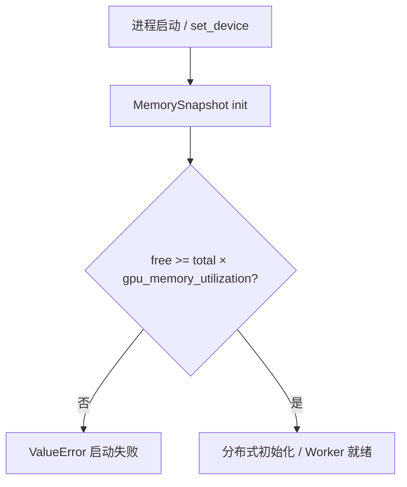
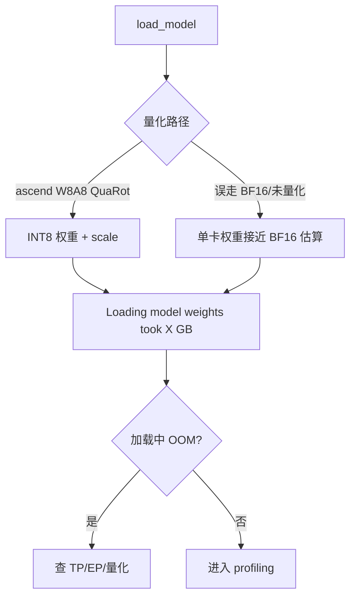
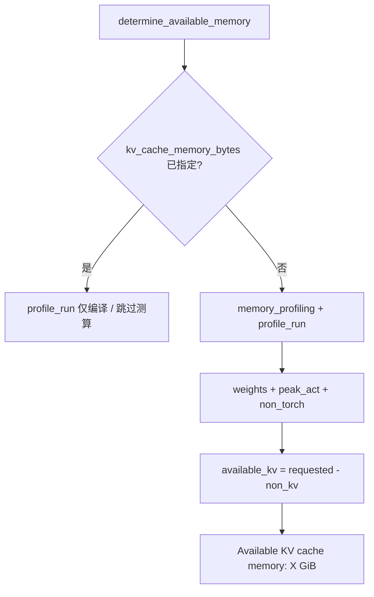
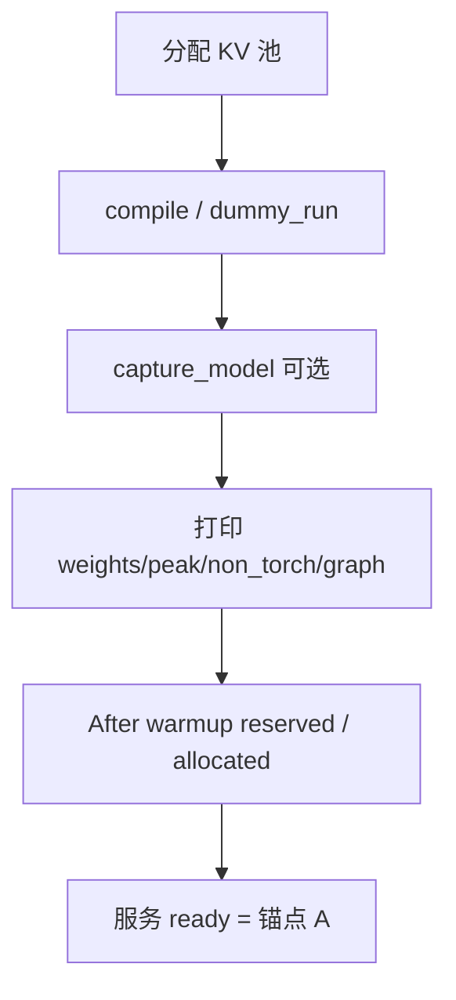
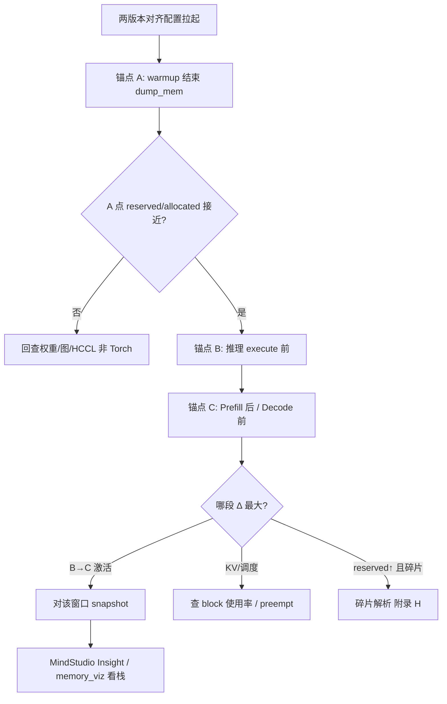
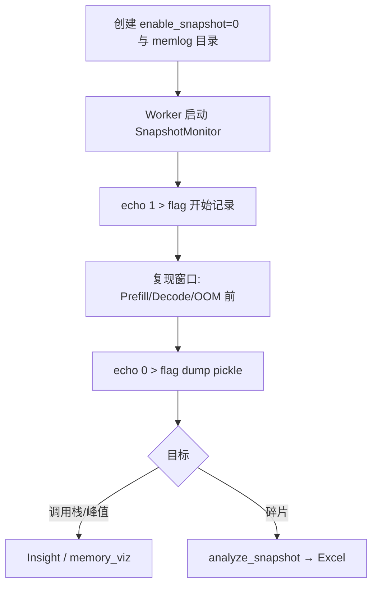
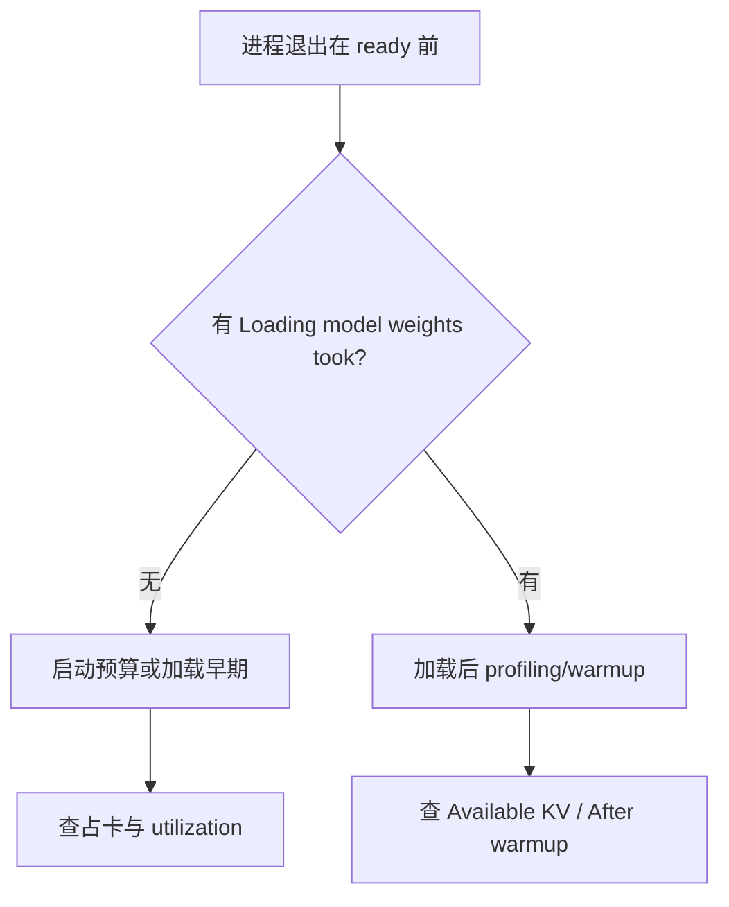
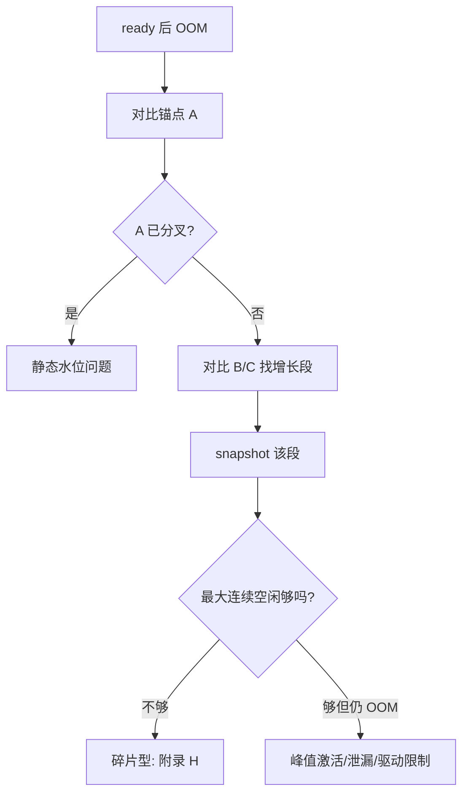
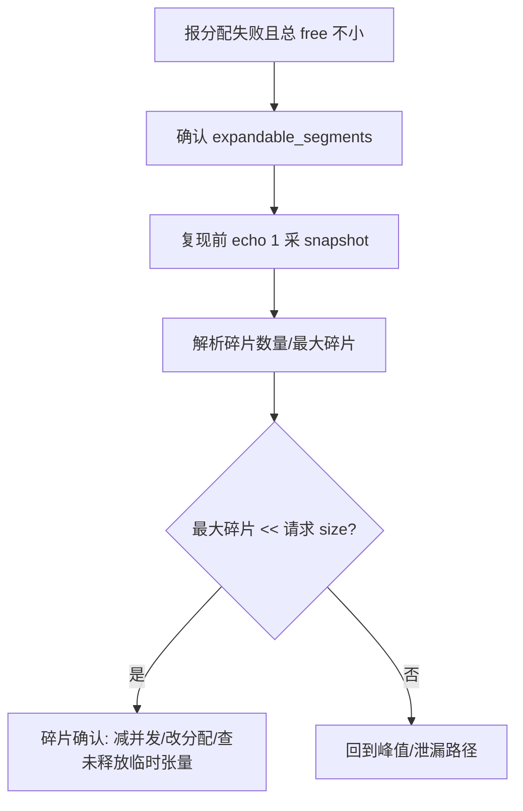

# 显存分析与 OOM 定位指南

> **可渲染流程图 / 模型报告（请用浏览器打开）**
> - [显存分析与OOM定位指南.html](./显存分析与OOM定位指南.html) — 含 Mermaid.js 流程图（附录 D/F）
> - [MiniMax-M2.7-w8a8-QuaRot-analysis-report.html](./MiniMax-M2.7-w8a8-QuaRot-analysis-report.html) — 模型分析 skill 显存报告
>
> 说明：本 Markdown 附录中的 ` ```mermaid ` 代码块在 Cursor 默认预览中通常**不会**画成图；要看图请打开上方 HTML。

这是什么：vLLM / vLLM-Ascend 推理服务的显存由「权重 + 峰值激活 + 非 Torch 开销 + NPU Graph + KV Cache」构成。本指南覆盖从启动 profiling → warmup → 正式推理的完整显存链路，以及 OOM / 碎片型 OOM 的日志定位、阶段对比与 snapshot 采集方法。

覆盖范围：显存构成与预算公式 → Worker 初始化 / `memory_profiling` → warmup 结束水位 → 推理阶段增长对比 → SnapshotMonitor / 碎片解析 → MiniMax-M2.7-w8a8-QuaRot 显存估算

涉及组件：`NPUWorker` / `GPUWorker`、`MemorySnapshot` / `memory_profiling`、`NPUModelRunnerV1` / `GPUModelRunner`、KV Cache Allocator、PyTorch NPU Caching Allocator、`SnapshotMonitor`（详见 附录 A）

| 术语 | 含义 |
|------|------|
| reserved | `torch.npu.memory_reserved()`：Caching Allocator 向驱动预留的总量 |
| allocated | `torch.npu.memory_allocated()`：当前仍被张量占用的量 |
| free / total | `torch.npu.mem_get_info()`：设备空闲 / 总量（含非 Torch 占用） |
| non_kv_cache_memory | profiling 后：weights + peak_activation + non_torch |
| available_kv_cache_memory | `requested_memory - non_kv_cache_memory`，用于分配 KV 池 |
| requested_memory | `total_memory × gpu_memory_utilization` |
| segment_map / alloc / free | Allocator 事件：扩段 / 分配 / 释放；空白 inactive block = 碎片 |
| 瞬时峰值 OOM | 总空闲不足，单次大 alloc 直接超限 |
| 碎片型 OOM | reserved−allocated 很大，但最大连续空闲块不够，大张量分配失败 |
| warmup | `determine_available_memory` + `compile_or_warm_up_model` 完成、服务可接请求前 |

你需要准备：

日志文件：
- 标准输出（含 vllm / vllm_ascend INFO 日志）
- vLLM-Ascend 文件日志：`~/ascend/log/vllm_ascend/` 轮转日志
- （可选）npu-smi / `msmonitor` 导出

快速过滤：
```bash
# 显存预算与 KV 相关
grep -nE "(Available KV cache memory|Loading model weights took|Free memory on device|gpu_memory_utilization|kv-cache-memory|OOM|out of memory|NPU out of memory|CUDA out of memory)" <日志文件>

# warmup / profiling
grep -nE "(memory_profiling|peak activation|non-torch|NPU graph memory|After warmup|Compile and warming up|capture_model|Profiling)" <日志文件>

# snapshot
grep -nE "(Snapshot monitor|Enable snapshot|save memory history)" <日志文件>
```

阅读优先级：紧急排障 → 直接看下方「判断口诀」与 §三；系统了解 → 按 §一 → §二 → §四（模型算例）→ 附录顺序读

## 目录

- 一、快速定位（先看这里）
- 二、分阶段详细定位
  - 2.1 阶段 1：进程启动与设备初始化
  - 2.2 阶段 2：权重加载
  - 2.3 阶段 3：memory_profiling / 可用 KV 测算
  - 2.4 阶段 4：KV Cache 池分配与图编译 / warmup
  - 2.5 阶段 5：正式推理（Prefill / Decode）
  - 2.6 阶段 6：Snapshot 与碎片分析
- 三、卡点速查（卡在 X → 查 Y）
- 四、MiniMax-M2.7-w8a8-QuaRot 显存分析
- 五、附录
  - A. 涉及仓库与组件
  - B. 关键配置与环境变量
  - C. 全量日志逐步明细
  - D. 全量流程图（Mermaid）
  - E. 关键节点索引
  - F. 故障场景流程
  - G. SnapshotMonitor 接入与采集细则
  - H. 显存碎片：何时采、怎么采、怎么读

---

## 一、快速定位（先看这里）

30 秒速判：在日志里搜下面几步的标志日志，最后出现的那条 = 你卡在哪一步，直接跳对应 §二或 §三。

| 步骤 | 标志日志（grep 关键字） | 走到了哪个阶段 | 正常应接着看到 | 没走到 → 备查 |
|------|-------------------------|----------------|----------------|---------------|
| 1 | `Free memory on device ... is less than desired GPU memory utilization` | 启动时显存预算不足 | （进程直接退出） | §三“启动即 OOM 预算失败” C.1 → D.1 |
| 2 | `Loading model weights took %.4f GB` | 权重加载完成 | profiling / Available KV | §三“权重加载 OOM” C.2 → D.2 |
| 3 | `Available KV cache memory: %.2f GiB` | profiling 完成，KV 预算算出 | KV 分配 / warmup | §三“KV 预算为负或过小” C.3 → D.3 |
| 4 | `After warmup: torch reserved memory ... allocated memory ...` | warmup / 图捕获结束 | 服务 ready、可接请求 | §三“warmup / 图捕获 OOM” C.4 → D.4 |
| 5 | 推理中 `NPU out of memory` / `CUDA out of memory` / Ascend 分配失败 | 推理阶段 OOM | — | §三“推理 OOM” + §2.5 阶段对比 → D.5 / F.2 |
| 6 | reserved 很高但报连续内存不足 / alloc 失败且 free 总量仍大 | 疑似碎片型 OOM | 需 snapshot | §2.6 / 附录 H → D.6 |

判断口诀：

1. 搜 `Loading model weights took` → 没搜到且进程已死 = 加载期 OOM（权重 / 通信缓冲）
2. 搜 `Available KV cache memory` → 出现负数或极小 = non_kv 吃光了 `gpu_memory_utilization` 预算
3. 搜 `After warmup` → 有这条说明服务侧静态水位已稳定；之后再 OOM 优先怀疑推理激活 / KV 增长 / 碎片
4. **同配置两版本对比**：一版正常、一版推理 OOM → 先比 warmup 结束水位，再比首请求 Prefill 前后，再用 snapshot 钉调用栈
5. reserved−allocated 持续很大且大 alloc 失败 → 采碎片（附录 H），不要只看 `npu-smi` 总占用

跨阶段图链接：D.5 推理 OOM 决策 · D.6 Snapshot 启停 · F 故障场景 · §四 模型算例

---

## 二、分阶段详细定位

### 2.1 阶段 1：进程启动与设备初始化

在干什么：NPU 设备绑定、分布式初始化、记录 `init_snapshot`，并检查 `free_memory >= total × gpu_memory_utilization`。

子环节表：

| 子环节 | 关键日志 | 正常含义 | 异常时/分支 |
|--------|--------|----------|-------------|
| 设备初始化 | （设备 set_device / HCCL 相关） | 运行时与通信栈就绪 | 驱动 / 可见卡问题 |
| 初始快照 | （代码内 `MemorySnapshot`） | 记录 free/total/torch/non_torch | — |
| 预算检查失败 | `Free memory on device (x/y GiB) on startup is less than desired GPU memory utilization` | 启动即拒绝 | 降 `gpu_memory_utilization` 或清其他占卡进程 |

定位注意：

- 该阶段失败与模型无关，是「卡上已被占用」或 utilization 设太高。
- Ascend 建议配合 `PYTORCH_NPU_ALLOC_CONF=expandable_segments:True`，降低后续碎片概率（不能解决启动预算失败）。

→ 全量表：C.1 · 流程图：D.1

### 2.2 阶段 2：权重加载

在干什么：`load_model()` 把权重装到 NPU；日志打印权重占用 GiB。

子环节表：

| 子环节 | 关键日志 | 正常含义 | 异常时/分支 |
|--------|--------|----------|-------------|
| 开始加载 | `Starting to load model %s...` | 进入加载 | — |
| 加载完成 | `Loading model weights took %.4f GB` | 权重显存落盘到卡 | 加载中途 OOM → 查 TP/EP/量化是否匹配权重 |
| 量化路径 | `--quantization ascend`（W8A8 QuaRot） | INT8 权重 + scale | 误用 bf16/fp8 路径会导致单卡权重翻倍级上涨 |

定位注意：

- W8A8 QuaRot 权重远小于 BF16；若日志中 weights GiB 接近 BF16 估算，说明量化未生效。
- MoE + EP 下，单卡权重 ≈ 复制部分(K+attn/TP) + 专家分片(Q_experts/EP)。

→ 全量表：C.2 · 流程图：D.2 · 模型数字：§四

### 2.3 阶段 3：memory_profiling / 可用 KV 测算

在干什么：`determine_available_memory()` 在 `memory_profiling` 上下文中跑 `profile_run()`（dummy forward），估算 peak activation 与 non-torch 增长，得到：

```text
available_kv = requested_memory - (weights + peak_activation + non_torch)
```

子环节表：

| 子环节 | 关键日志 | 正常含义 | 异常时/分支 |
|--------|--------|----------|-------------|
| profiling | `Memory profiling takes ...`（DEBUG） | 打出 non_kv / peak / non_torch / weights | 无此日志时开 DEBUG |
| KV 预算 | `Available KV cache memory: %.2f GiB` | 后续 KV 池上限 | ≤0 或过小 → 无法支撑目标 `max_model_len` |
| 指定 KV | `reserved ... as specified by kv_cache_memory_bytes` | 跳过测算，手动指定 KV | OOM 时按日志提示回退调整 |

定位注意：

- vLLM-Ascend 会在图捕获前截取 `torch_peak`，避免把 graph pool 误算进 activation。
- profiling 与真实长上下文 Prefill 的激活峰值可能仍有差距 → 推理 OOM 时不要只信这一步。

→ 全量表：C.3 · 流程图：D.3

### 2.4 阶段 4：KV Cache 池分配与图编译 / warmup

在干什么：按 available KV 分配 block 池；`compile_or_warm_up_model` 做 dummy run / NPU Graph capture；日志建议 `--kv-cache-memory`，并打印 **After warmup** reserved/allocated。

子环节表：

| 子环节 | 关键日志 | 正常含义 | 异常时/分支 |
|--------|--------|----------|-------------|
| 编译 warmup | `Compile and warming up model for size %d` | 按 size 预热 | 某 size OOM → 降 `max_num_batched_tokens` / 关部分 cudagraph |
| 图捕获 | capture / cudagraph 相关 | Graph 常驻显存计入 non_kv | 捕获期峰值高于稳态 |
| warmup 汇总 | `After warmup: torch reserved memory X GiB, torch allocated memory Y GiB` | **静态水位基线** | 与正常版本对比的关键锚点 |
| KV 建议 | `Replace gpu_memory_utilization with --kv-cache-memory=...` | 便于下次固定 KV | 两版本 KV 建议值差大 → non_kv 结构变了 |

定位注意：

- **把「After warmup」行当作版本对比的 T0 基线**：记录 reserved / allocated / Available KV / 建议 kv-cache-memory。
- Graph 内存会抬高 reserved；对比时确认两边 `compilation-config` / `cudagraph_mode` 一致。

→ 全量表：C.4 · 流程图：D.4

### 2.5 阶段 5：正式推理（Prefill / Decode）——版本对比定位法

在干什么：服务 ready 后接真实请求。Prefill 激活峰值通常高于 Decode；KV 随 token 增长占用已预留池（一般不再扩 reserved，除非池不够或临时 workspace 额外申请）。

#### 2.5.1 推荐对比实验（一版正常 / 一版推理 OOM）

控制变量：同一模型路径、同一并行（TP/DP/EP）、同一 `gpu_memory_utilization` / `max_model_len` / `max_num_seqs` / `max_num_batched_tokens` / 量化与 `compilation-config`。

在以下锚点打印（或打日志）同一组指标：

| 锚点 | 建议打印内容 | 目的 |
|------|--------------|------|
| A. warmup 刚结束 | reserved、allocated、mem_get_info free、Available KV、KV block 数 | 静态基线 |
| B. 首个 Prefill 即将 `execute_model` 前 | 同上 + 本 step `num_scheduled_tokens` / runningseqs | 看调度是否异常放大 batch |
| C. Prefill 峰值后 / Decode 前 | reserved、allocated、peak allocated | 看激活是否回落 |
| D. OOM 前最后一步 | SchedulerOutput 规模、是否图回退、是否新增临时缓冲 | 钉增长来源 |

示例探针（可临时打在 worker / model_runner，或独立 debug 接口）：

```python
import torch
from vllm.utils.mem_utils import format_gib

def dump_mem(tag: str):
    free, total = torch.npu.mem_get_info()
    print(
        f"[{tag}] reserved={format_gib(torch.npu.memory_reserved())}GiB "
        f"allocated={format_gib(torch.npu.memory_allocated())}GiB "
        f"free={format_gib(free)}GiB total={format_gib(total)}GiB "
        f"peak_alloc={format_gib(torch.npu.memory_stats().get('allocated_bytes.all.peak', 0))}GiB",
        flush=True,
    )
```

对比判读：

| 现象 | 更可能原因 | 下一步 |
|------|------------|--------|
| A 点异常版本已明显高于正常版 | 权重路径 / 图捕获 / 非 Torch（HCCL）差异 | 回看 §2.2–2.4，对齐量化与编译配置 |
| A 接近，B→C 激增后 OOM | Prefill 激活 / MoE workspace / 临时张量 | 对该区间开 snapshot（附录 G/H） |
| allocated 回落但 reserved 只增不减，随后大 alloc 失败 | 碎片或 expandable segment 行为异常 | 采碎片；确认 `expandable_segments` |
| KV 池日志显示不足 / 频繁 preempt | KV 预算不够或前缀缓存异常 | 降 `max_model_len`/`max_num_seqs` 或升 utilization |

#### 2.5.2 增长归因口诀

```text
Δreserved(A→B) ≈ 0 且 Δallocated 大     → 激活/临时张量（池内复用）
Δreserved 明显上升                         → 新 segment_map / 图 / 通信缓冲
Δallocated 随 decode 缓慢爬升且不回落       → KV 占用增长或泄漏嫌疑
总 free 够但最大空闲块不够                  → 碎片型 OOM（附录 H）
```

→ 全量表：C.5 · 流程图：D.5 · 故障：F.2

### 2.6 阶段 6：Snapshot 与碎片分析

在干什么：用 `torch.npu.memory._record_memory_history` + `_dump_snapshot` 导出 pickle，再用 MindStudio Insight / memory_viz / 本地解析脚本看 alloc 栈与碎片。

子环节表：

| 子环节 | 关键日志 | 正常含义 | 异常时/分支 |
|--------|--------|----------|-------------|
| monitor 启动 | `Snapshot monitor started, watching ...` | 轮询 flag 文件 | 未注入代码则无此日志 |
| 开始记录 | `Enable snapshot, start record memory history` | flag 0→1 | — |
| 落盘 | `Enable snapshot, save memory history to: ...pickle` | flag 1→0 | 目录权限 / 磁盘空间 |

**什么时候必须采 snapshot / 碎片**：见附录 H（场景清单）。短结论：

- 仅总占用飙高、栈不明 → 采 snapshot（事件 + 调用栈）
- 总空闲看起来够却分配失败 → **必须**采碎片分析
- 两版本 A 点接近、仅推理区间分叉 → 只对分叉窗口采（先 1 后 0），避免 pickle 过大

→ 采集细则：附录 G · 碎片专章：附录 H · 流程图：D.6

---

## 三、卡点速查（卡在 X → 查 Y）

| 你卡在这里 | 落在哪个大阶段 | 优先查什么 | 常见原因 |
|------------|----------------|------------|----------|
| 启动即报 desired GPU memory utilization | 阶段1 | 其他进程占卡、utilization | 残留进程、utilization 过高 |
| 权重加载中途 OOM | 阶段2 | 量化是否生效、TP/EP | 误走 BF16；EP 过小导致单卡专家过大 |
| 无 `Available KV cache memory` 或进程死在 profiling | 阶段3 | profile_run 峰值、`max_num_batched_tokens` | dummy forward 激活过大 |
| Available KV 过小 / 无法 serve 单请求 | 阶段3/4 | weights+activation+graph 是否涨 | 图模式、通信缓冲、量化失败 |
| warmup / capture_model OOM | 阶段4 | cudagraph_mode、compile sizes | 图捕获峰值；可先 `FULL_DECODE_ONLY` 或降 batch |
| 服务起来后首请求 Prefill OOM | 阶段5 | A/B/C 锚点对比 + snapshot | 真实序列激活 > profiling；MoE workspace |
| Decode 一段时间后 OOM | 阶段5 | KV 是否打满、是否泄漏、碎片 | 长输出；临时缓冲未释放；碎片 |
| 报内存不足但 npu-smi 仍有空闲 | 阶段5/6 | reserved−allocated、碎片表 | 碎片型 OOM |
| 同配置旧版本正常新版本推理 OOM | 阶段4→5 | A 点对比 → 分叉窗口 snapshot | 激活估算变化、算子 workspace、泄漏 |

排查顺序：

1. 确认启动预算与权重 GiB  
2. 确认 Available KV 与 After warmup 水位  
3. 正常版 vs 异常版做 A/B/C 锚点对比  
4. 对增长窗口 `echo 1/0` 采 snapshot  
5. 若疑似碎片 → 跑碎片解析（附录 H）

---

## 四、MiniMax-M2.7-w8a8-QuaRot 显存分析

> 数据来源：`MiniMaxAI/MiniMax-M2.7` 的 `config.json` + `model.safetensors.index.json` + `modeling_minimax_m2.py`；部署口径参考 vLLM-Ascend 教程（ModelScope：`vllm-ascend/MiniMax-M2.7-w8a8-QuaRot`）。W8A8-QuaRot 为 Ascend 侧量化权重，架构与 FP8 基座一致。  
> 单位说明：参数量用 **B = 10⁹**；显存 GB=10⁹ bytes，GiB=2³⁰ bytes。KV 行同时给出便于对照。

### 4.1 架构与参数量（显存相关）

| 配置项 | 值 |
|--------|-----|
| hidden_size | 3072 |
| num_hidden_layers | 62（attn_type_list 全 1，满注意力） |
| num_attention_heads / num_key_value_heads | 48 / 8（GQA） |
| head_dim / rotary_dim | 128 / 64 |
| intermediate_size（专家 FFN） | 1536 |
| num_local_experts / num_experts_per_tok | 256 / 8 |
| vocab_size | 200064 |
| max_position_embeddings | 204800 |
| use_qk_norm / qk_norm_type | true / per_layer |
| tie_word_embeddings | false |
| 基座 quantization_config | FP8 block 128×128（HF 权重）；Ascend 部署用 W8A8-QuaRot + `--quantization ascend` |
| MTP | config 声明 `use_mtp` / `num_mtp_modules=3`；**本仓库 weight_map 未见 MTP 权重**，下表总量不含 MTP |

独立估算（与 weight_map 结构一致：每层 `w1/w2/w3` + GQA + gate + bias）：

| 分项 | 公式要点 | 参数量 |
|------|----------|--------|
| Embedding + LM Head | `2 × vocab × hidden` | 1.230 B |
| Attention ×62 | Q/K/V/O + per-layer QK Norm | 2.730 B |
| MoE experts ×62 | `256 × 3 × H × I` | 224.680 B |
| Gate + norms 等 | router + RMSNorm | ~0.049 B |
| **合计** | | **≈ 228.7 B** |
| **每 token 激活参数** | 非专家全量 + top-8 专家 | **≈ 11.03 B** |

checkpoint `metadata.total_size ≈ 480.8 GB`，与「~229B 以约 2B/param 量级落盘（含 scale 等）」同量级；W8A8-QuaRot 线上权重按 INT8 GEMM 计费。

### 4.2 每 Token KV Cache

GQA：`n_kv × head_dim × 2 × dtype × layers`

| KV dtype | B/token | KiB/token | 4k | 32k | 40.69k（教程短上下文） | 128k | 196608 |
|----------|---------|-----------|-----|-----|-------------------------|------|--------|
| BF16 | 253952 | 248.00 | 1.04 GB | 8.32 GB | 10.33 GB | 33.29 GB | 49.93 GB |
| FP8 / INT8（含 W8A8C8 的 C8 KV） | 126976 | 124.00 | 0.52 GB | 4.16 GB | 5.17 GB | 16.64 GB | 24.96 GB |

相对 MHA（n_kv=n_h=48）压缩比：`8/48 ≈ 16.7%`（约 6×）。

### 4.3 单卡权重量（W8A8 / 并行）

约定：

- **K（BF16，复制）**：embedding、lm_head、RMSNorm、QK Norm、MoE gate / bias  
- **Q_rep（量化，随 TP 切分）**：Attention 投影  
- **Q_experts（量化，随 EP 切分）**：routed experts  

```text
W_card ≈ K×2 + (Q_rep / TP)×b + (Q_experts / EP)×b
W8A8: b=1.0 ；仅 EP、TP=1 时 Q_rep 不切分
```

| 并行（常见部署） | 量化 | 约计单卡权重 | 64GB 卡权重占比 | 备注 |
|------------------|------|--------------|-----------------|------|
| TP4 DP4 EP16 | W8A8 | **~17.3 GB** | ~27% | A3 教程短上下文常用 |
| TP8 DP1 EP8 | W8A8 | **~31.0 GB** | ~48% | 单机 8 卡 EP |
| TP16 DP1 EP16 | W8A8 | **~16.8 GB** | ~26% | A3 16 卡 |
| TP4 DP1 EP4 | W8A8 | **~59.4 GB** | ~93% ⚠ | 余量极小，易被激活/KV 打爆 |
| 纯 EP=8 TP=1 | W8A8 | ~33.4 GB | ~52% | 注意力未切分，一般不推荐 |

选型要点：

1. W8A8 相对 BF16，专家项近似减半，EP 较小时收益最大。  
2. **EP 翻倍 ≠ 总显存减半**：K + attn/TP 基线仍在。  
3. 64GB 卡上优先 TP4DP4 或 TP16；KV+激活+Graph 通常还要再留 **15–25GB+** 量级（视 `max_model_len` / `max_num_seqs`）。  
4. 长上下文（~128k+）按教程倾向更大 TP、更小 `max_num_seqs`，并慎用与 M2.5 相同的 Eagle3（M2.7 上可能无收益）。

### 4.4 部署侧显存相关推荐（摘自 vLLM-Ascend）

```bash
export PYTORCH_NPU_ALLOC_CONF=expandable_segments:True
export HCCL_BUFFSIZE=1024   # 或 512，视通信与显存权衡
export VLLM_ASCEND_ENABLE_FLASHCOMM1=1

vllm serve /path/to/MiniMax-M2.7-w8a8-QuaRot \
  --quantization ascend \
  --trust-remote-code \
  --enable-expert-parallel \
  --tensor-parallel-size 4 --data-parallel-size 4 \
  --gpu-memory-utilization 0.85 \
  --max-num-seqs 48 \
  --max-model-len 40690 \
  --max-num-batched-tokens 16384 \
  --compilation-config '{"cudagraph_mode":"FULL_DECODE_ONLY"}' \
  --async-scheduling
```

OOM 时官方 FAQ 建议：先降 `--max-num-seqs` 与 `--max-num-batched-tokens`，再降并发压测。

### 4.5 该模型上的典型 OOM 画像

| 画像 | 特征 | 优先动作 |
|------|------|----------|
| 权重装不下 | 加载期死；weights GiB 异常大 | 查 QuaRot 路径与 EP |
| warmup 后 KV 过小 | Available KV 很小；长请求无法调度 | 降 max_model_len / 升 utilization / 查 graph |
| Prefill 爆 | A 正常，首包长 prompt OOM | 降 `max_num_batched_tokens`；对该窗口 snapshot |
| 碎片爆 | 空闲总量尚可，MoE 大 workspace alloc 失败 | `expandable_segments` + 碎片采集 |

---

## 五、附录

### A. 涉及仓库与组件

| 仓库/组件 | 文件 | 类/函数 | 说明 |
|-----------|------|---------|------|
| vllm | `vllm/utils/mem_utils.py` | `MemorySnapshot` / `memory_profiling` | 显存快照与 profiling 上下文 |
| vllm | `vllm/v1/worker/gpu_worker.py` | `determine_available_memory` | GPU 侧 KV 预算 |
| vllm-ascend | `vllm_ascend/worker/worker.py` | `NPUWorker.determine_available_memory` / `compile_or_warm_up_model` | NPU 侧预算、After warmup 日志 |
| vllm-ascend | `vllm_ascend/worker/model_runner_v1.py` | `NPUModelRunnerV1` | profile_run / execute / graph |
| vllm | `vllm/v1/core/kv_cache_utils.py` | KV 容量检查 | KV 不够时的报错文案 |
| 自定义 | worker 注入 | `SnapshotMonitor` | flag 文件控制的 NPU memory history |

### B. 关键配置与环境变量

| 配置项 | 日志/行为体现 | 说明 |
|--------|---------------|------|
| `--gpu-memory-utilization` | requested_memory；启动预算检查 | 默认常见 0.85–0.92 |
| `--kv-cache-memory` | 跳过测算，固定 KV | 两版本对比时便于对齐 |
| `--max-model-len` / `--max-num-seqs` / `--max-num-batched-tokens` | 影响激活与 KV | OOM 首选旋钮 |
| `--quantization ascend` | W8A8 QuaRot | MiniMax-M2.7-w8a8-QuaRot 必需 |
| `--enable-expert-parallel` + TP/DP | 单卡专家分片 | 决定 Q_experts/EP |
| `--compilation-config cudagraph_mode` | Graph 常驻显存 | `FULL_DECODE_ONLY` 较稳 |
| `PYTORCH_NPU_ALLOC_CONF=expandable_segments:True` | 降低碎片 | 碎片型 OOM 优先开启 |
| `HCCL_BUFFSIZE` | 非 Torch 显存 | 过大挤占 KV |
| Snapshot `flag_file` | `/home/enable_snapshot` | `1` 开始记录，`0` dump |

### C. 全量日志逐步明细

#### C.1 阶段 1：启动预算

| 序号 | 子模块 | 日志原文 | 说明 |
|------|--------|----------|------|
| 1 | `worker.py` | `Free memory on device (%s/%s GiB) on startup is less than desired GPU memory utilization (%s, %s GiB)...` | 启动失败。标志日志 |

#### C.2 阶段 2：权重

| 序号 | 子模块 | 日志原文 | 说明 |
|------|--------|----------|------|
| 2 | `model_runner_v1.py` | `Starting to load model %s...` | 开始加载 |
| 3 | `model_runner_v1.py` | `Loading model weights took %.4f GB` | 权重 GiB。标志日志 |

#### C.3 阶段 3：profiling / KV 预算

| 序号 | 子模块 | 日志原文 | 说明 |
|------|--------|----------|------|
| 4 | `mem_utils.py` | `Memory profiling takes ... Total non KV cache memory: ...` | DEBUG |
| 5 | `worker.py` | `Available KV cache memory: %.2f GiB` | 标志日志 |
| 6 | `worker.py` | `... as specified by kv_cache_memory_bytes, skipping memory profiling...` | 手动 KV |

#### C.4 阶段 4：warmup / 图

| 序号 | 子模块 | 日志原文 | 说明 |
|------|--------|----------|------|
| 7 | `worker.py` | `Compile and warming up model for size %d` | 预热 size |
| 8 | `worker.py` | `Free memory on device ... Actual usage: ... for weights, ... for peak activation, ... for non-torch memory, ... for NPU graph memory. Replace ... --kv-cache-memory=... After warmup: torch reserved memory ... allocated memory ...` | **warmup 基线**。标志日志 |

#### C.5 阶段 5–6：推理 OOM / snapshot

| 序号 | 子模块 | 日志原文 | 说明 |
|------|--------|----------|------|
| 9 | runtime | `NPU out of memory` / `ACL_ERROR_RT_MEMORY_*` / `CUDA out of memory` | 推理/分配失败 |
| 10 | SnapshotMonitor | `Snapshot monitor started...` / `Enable snapshot, start record...` / `save memory history to: ...pickle` | 采集链路 |

### D. 全量流程图（Mermaid）

#### D.1 启动与显存预算



#### D.2 权重加载



#### D.3 profiling 与 KV 预算



#### D.4 warmup 与 After warmup 基线



#### D.5 推理 OOM：正常版 vs 异常版对比



#### D.6 Snapshot 启停



### E. 关键节点索引

| 阶段 | 关键日志（grep） | 说明 |
|------|-----------------|------|
| 启动 | `less than desired GPU memory utilization` | 启动预算失败 |
| 权重 | `Loading model weights took` | 权重量 |
| KV | `Available KV cache memory` | KV 预算 |
| warmup | `After warmup: torch reserved memory` | 静态基线 |
| 建议 | `--kv-cache-memory=` | 固定 KV 提示 |
| snapshot | `Enable snapshot` | 采集开关 |
| OOM | `out of memory` | 失败点 |

### F. 故障场景流程

#### F.1 启动 / 加载 OOM



#### F.2 推理期 OOM（含版本对比）



#### F.3 碎片型 OOM



### G. SnapshotMonitor 接入与采集细则

#### G.1 原理

- `torch.npu.memory._record_memory_history()`：记录 segment_map/unmap、alloc、free 及栈。  
- `_dump_snapshot(path)`：写出 `.pickle`。  
- 用 flag 文件避免一直记录（pickle 膨胀、有开销）。

#### G.2 注入位置（示例）

在 `vllm_ascend/worker/worker.py` 初始化末尾：

```python
self.snapshot_monitor = SnapshotMonitor(
    local_rank=local_rank,
    dp=self.parallel_config.data_parallel_rank,
    flag_file="/home/enable_snapshot",
    interval=0.5,
    save_dir="/home/npu_memory_snapshot",
)
self.snapshot_monitor.start()
```

核心行为：

| flag | 行为 |
|------|------|
| 启动时为 0 | 仅轮询，不记录 |
| 0→1 | `_record_memory_history()` |
| 1→0 | `_dump_snapshot` 后关闭记录 |
| interval | 默认 0.5s；短进程可调小 |

文件名建议：`vllm_snapshot_dp{dp}_rank{rank}_count{n}.rand{r}.pickle`，避免多卡覆盖。

`SnapshotMonitor` 参考实现：

```python
import os
import random
import threading
import torch
from vllm.logger import logger

class SnapshotMonitor:
    def __init__(
        self,
        local_rank: int,
        dp: int = -1,
        flag_file: str = "/home/enable_snapshot",
        interval: float = 0.5,
        save_dir: str = "/home/memlog",
    ):
        self.local_rank = local_rank
        self.flag_file = flag_file
        self.interval = interval
        self.save_dir = save_dir
        self._stop_event = threading.Event()
        self._thread = None
        self._recording = False
        self.count = 0
        self.dp = dp

    def start(self):
        if self._thread is not None:
            return
        self._thread = threading.Thread(
            target=self._monitor_loop, daemon=True, name="snapshot-monitor"
        )
        self._thread.start()
        logger.info(
            "Snapshot monitor started, watching %s, snapshot save dir: %s",
            self.flag_file, self.save_dir,
        )

    def stop(self):
        if self._thread is None:
            return
        self._stop_event.set()
        self._thread.join(timeout=5)

    def _read_flag(self) -> bool:
        try:
            with open(self.flag_file, "r") as f:
                return f.read().strip() == "1"
        except Exception:
            return False

    def _start_record(self):
        if self._recording:
            return
        logger.info("Enable snapshot, start record memory history")
        torch.npu.memory._record_memory_history()
        self._recording = True

    def _stop_record(self):
        if not self._recording:
            return
        rand = random.randint(1, 100000)
        self.count += 1
        file_name = (
            f"vllm_snapshot_dp{self.dp}_rank{self.local_rank}_count{self.count}"
            f".rand{rand}.pickle"
        )
        tmpfile = os.path.join(self.save_dir, file_name)
        os.makedirs(self.save_dir, exist_ok=True)
        logger.info("Enable snapshot, save memory history to: %s", tmpfile)
        try:
            torch.npu.memory._dump_snapshot(tmpfile)
        finally:
            torch.npu.memory._record_memory_history(enabled=None)
            self._recording = False

    def _monitor_loop(self):
        last_state = self._read_flag()
        if last_state:
            self._start_record()
        while not self._stop_event.is_set():
            try:
                current_state = self._read_flag()
                if not last_state and current_state:
                    self._start_record()
                elif last_state and not current_state:
                    self._stop_record()
                last_state = current_state
            except Exception:
                logger.exception("Snapshot monitor error")
            self._stop_event.wait(self.interval)
```

碎片 Excel 解析脚本较长，请直接使用 `E:\huawei\snapshot采集脚本\analyze_snapshot.py`（或原 GitHub `显存分析` 文中完整版）；将 `__main__` 中的 `file_path` 改为实际 pickle 即可。

#### G.3 采集示例

**推理窗口手动采：**

```bash
mkdir -p /home/npu_memory_snapshot
echo 0 > /home/enable_snapshot
# 拉起服务，确认日志 Snapshot monitor started
echo 1 > /home/enable_snapshot   # 见 start record
# 发送会 OOM 或可疑的请求
echo 0 > /home/enable_snapshot   # 见 save memory history
```

**warmup 窗口采：** 在 `with memory_profiling(...):` 前后分别置 1 / 0，或在 `After warmup` 日志出现前后采一段，用于对比静态分配与碎片基线。

**版本对比采：** 正常版与异常版使用**同一锚点脚本**各采一份 A 后短窗口 + Prefill 窗口，再并排看 reserved/allocated 与 Excel 碎片列。

### H. 显存碎片：何时采、怎么采、怎么读

#### H.1 什么情况下需要采集显存碎片

优先采集（强烈建议）：

1. **碎片型 OOM**：报 NPU/CUDA 分配失败，但 `mem_get_info` 空闲或 `npu-smi` 仍显示较大剩余。  
2. **reserved ≫ allocated** 长期成立，且随后出现大张量（MoE workspace、长 Prefill 临时缓冲、graph 相关）分配失败。  
3. **同负载下吞吐变差 / 频繁内部重分配**：小请求还能跑，batch 或序列一长就挂。  
4. **多 stream / 多 DP 后 reserved 异常膨胀**：怀疑大量小 segment，段间不能复用。  
5. **版本对比**：A 点接近，异常版在推理窗口 `segment_map` 次数明显更多。

可以先不采碎片（先看总量表与日志）的情况：

1. 启动预算检查直接失败。  
2. 权重加载阶段就 OOM，且 weights GiB 已接近卡容量。  
3. Available KV 明显为负/过小，问题在预算公式而非碎片。  
4. 明确是单次超大 KV/激活峰值且 reserved 与 allocated 一起顶满。

需要同时采「全量 snapshot + 碎片表」的情况：既要调用栈（谁 alloc），又要证明「最大空闲块 < 请求 size」。

#### H.2 碎片在数据里长什么样

- Segment 内 `state=inactive` 的 block = 空闲可复用碎片（空泡）。  
- `reserved - allocated ≈` 碎片及相关对齐开销的粗度量（解析脚本开始前已存在的碎片可能统计不全，需注意日志说明）。  
- `segment_map` 常因**当前最大空泡 < 下一次 alloc 请求**而扩段，扩段后 reserved 上升，并可能短暂出现更大空泡再被 alloc 吃掉。

原笔记示例：下一步需 alloc 768MB，最大空泡仅 384MB → 先 `segment_map` 680MB，reserved 扩大后再 alloc。

#### H.3 解析怎么用

1. 导出 pickle 后可用：  
   - [PyTorch memory_viz](https://docs.pytorch.org/memory_viz)  
   - MindStudio Insight（建议 ≥ 26.1.0，大文件更稳）  
   - 本地 `analyze_snapshot.py`（`E:\huawei\snapshot*` 目录或原「显存分析」文中脚本）→ `memory_analysis.xlsx`  
2. Excel「碎片跟踪」关注列：类型、大小、reserved、allocated、碎片数量、碎片总大小、最大碎片大小、各碎片地址。  
3. 判读顺序：  
   - OOM/失败前最后几次 `alloc` 的 **请求 size**  
   - 当时 **最大碎片大小** 是否更小  
   - 之前是否连续 `segment_map`  
   - 调用栈是否落在同一临时缓冲 / MoE / attention workspace

#### H.4 缓解与验证

| 手段 | 说明 |
|------|------|
| `PYTORCH_NPU_ALLOC_CONF=expandable_segments:True` | 优先开启，减轻缓存分配碎片 |
| 降低并发 / `max_num_batched_tokens` | 减小峰值 workspace，降低扩段频率 |
| 避免热路径反复创建销毁大临时张量 | 减少 free 后碎片棋盘化 |
| 对齐正常版与异常版算子实现 | 防止新版本额外常驻缓冲 |
| 复现时固定随机与请求集 | 保证两份 pickle 可比 |

---

## 附：与旧版「显存分析」文档的关系

| 旧文内容 | 本文位置 |
|----------|----------|
| 背景问题分类（峰值 OOM / 碎片 / segment / 泄漏） | §一判断口诀 + §三 + 附录 H |
| SnapshotMonitor 代码与 flag 用法 | 附录 G |
| pickle 可视化与碎片 Excel 脚本 | 附录 H（脚本以仓库/本地 `analyze_snapshot.py` 为准，避免正文重复贴超长代码） |
| warmup / 推理采集示例 | §2.4–2.6、附录 G.3 |

新增相对旧文：

- 对齐「异步调度」文档的阶段化定位结构与 Mermaid 流程图  
- vLLM / vLLM-Ascend `memory_profiling` → Available KV → After warmup 日志链  
- **正常版 vs OOM 版** 的 warmup/推理锚点对比法  
- **MiniMax-M2.7-w8a8-QuaRot** 参数量 / KV / 单卡权重矩阵  
- **何时必须采碎片** 的明确场景清单  
